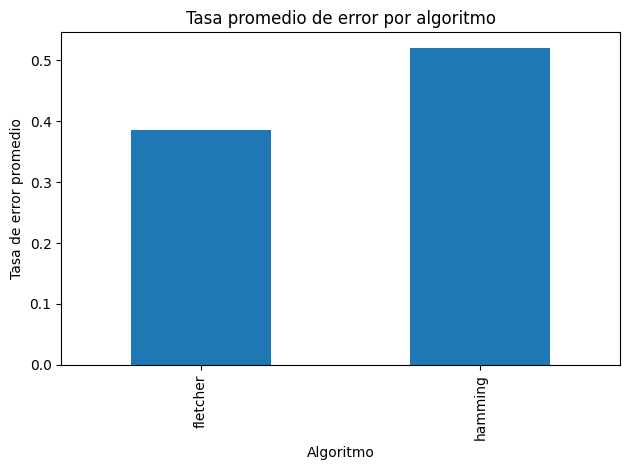
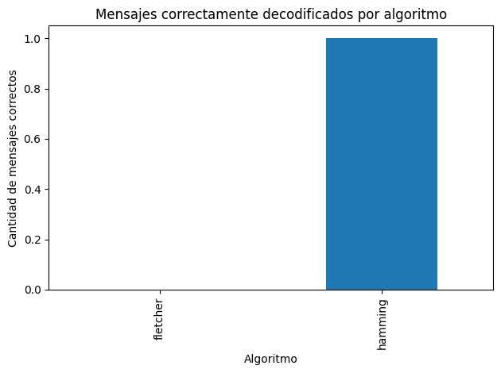
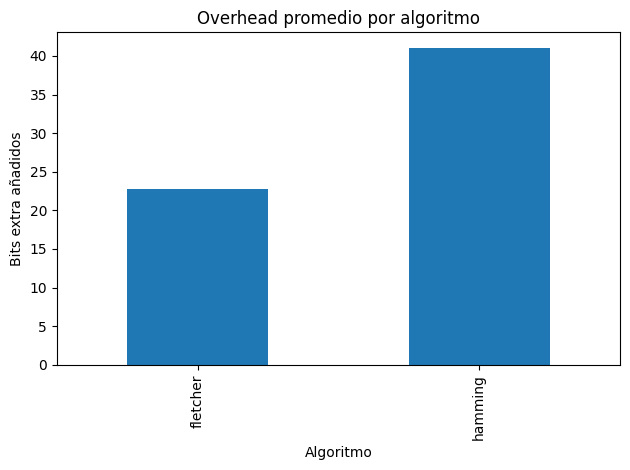
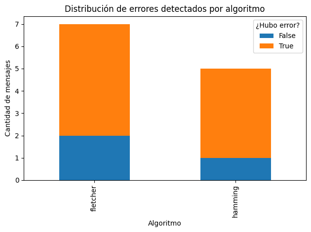
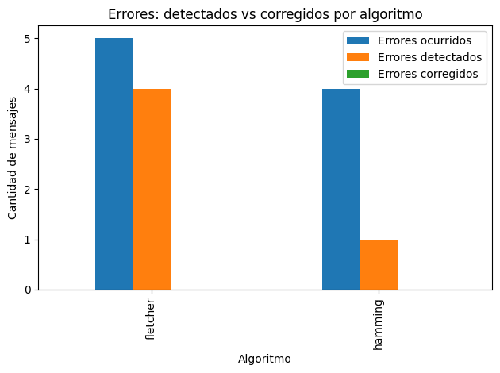
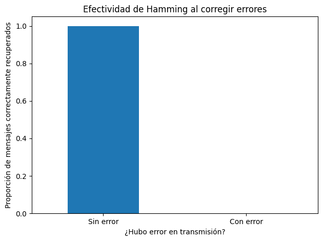
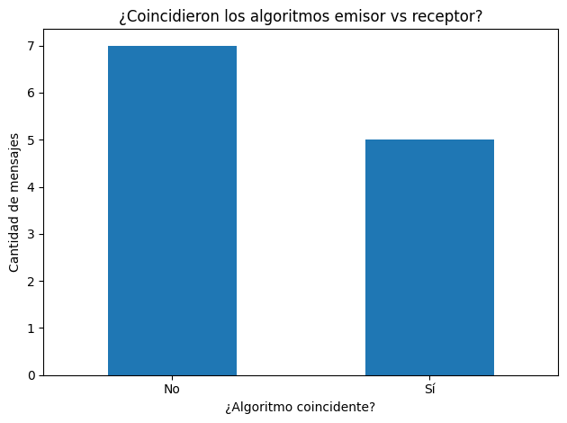
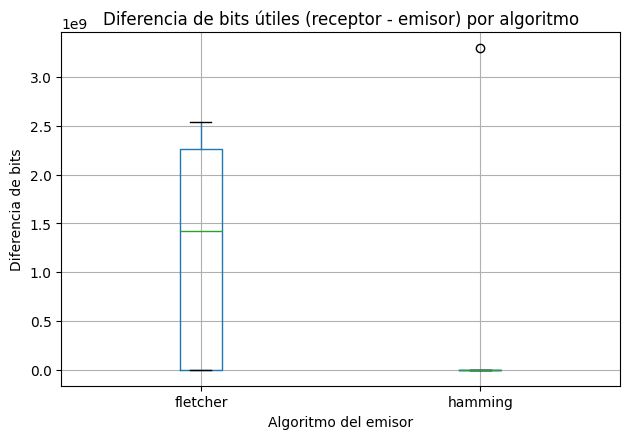

# Laboratorio 2 Parte 2: Esquemas de detección y corrección de errores🏗️

## Integrantes

- José Prince #22087
- Josue Say #22801

## Descripción de la práctica

En esta práctica de laboratorio se debe de desarrollar una arquitectura de capas, con las siguientes capas: Aplicación, Presentación, Enlace, Ruido (unicamente aplicable al emisor) y Transmisión. La implementación del emisor y receptor se realiza con diferentes lenguajes de programación. El envío de información del emisor al receptor se hace mediante sockets. Por cada servicio (emisor y receptor) se aplican algoritmos de detección y corrección de errores, estos permitiran codificar y decoficar el mensaje que se enviá.

## 🌐 Entorno

- **Python:** 3.10.12  
- **Maven:** 3.6.3  
- **Java:** OpenJDK 21.0.8 (Ubuntu)  
- **SO:** Linux (WSL2), kernel 6.6.87.2-microsoft-standard-wsl2, amd64  

## 🚀 Ejecutar el programa

### Consola del **Emisor**

```bash
cd emisor
python3 -m venv venv
source venv/bin/activate
pip install -r requirements.txt
python main.py
```

### Consola del **Receptor**

```bash
cd receptor
mvn clean compile
mvn exec:java
```

## 🔧 Hamming Configuración

```bash
[1 bit algoritmo][N bits indicando m][bits codificados con Hamming][paridad global opcional]
```

- El bit del algoritmo depende del valor que se coloca en el archivo `protocol.yaml` actualmente se coloca 0 para Hamming.
- Los bits apartados para representar la cantidad de bits de data son 5 y estan definidos en `protocol.yaml`.
- Los bits codificados con Hamming es el proceso hecho por el algoritmo (este recibe una cadena de bits que se pasa a binario de 8 bits actualmente el cual se define en `protocol.yaml`).
- El bit de paridad global utilizado para detectar más de 1 error, este bits se coloca siempre y cuando la propiedadad `extended` esta como `true` en `protocol.yaml`.

## 📊 Generación del reporte

Para la fase de pruebas se generaron archivos CSV tanto del lado del emisor como del receptor, registrando información relevante como los mensajes originales, los bits codificados, el algoritmo utilizado, la tasa de error y los resultados de detección/corrección. Posteriormente, utilizando un entorno en Jupyter Notebook, se realizó la unificación de ambos CSV mediante el campo del mensaje transmitido con ruido, permitiendo así vincular cada envío con su respectiva recepción.

A partir de esta fusión se procesaron los datos para generar gráficas de análisis, lo cual permitió visualizar patrones, diferencias de comportamiento entre algoritmos y los efectos del ruido sobre la comunicación. Para reproducir este análisis, basta con ejecutar una prueba entre el emisor y el receptor al menos una vez, y luego instalar las dependencias necesarias desde el archivo `requirements.txt`. Esto asegura que se cuente con los registros mínimos necesarios para generar los reportes correctamente.

## 🔄 Avances

Avances de la primera entrega creación de capa de aplicación, presentación, algoritmo y ruido.


## Resultados

Los resultados se encuentran en el directorio de ´data´, ahi se encuentran 3 csv que es de donde se obtuvo la información para hacer la gráficas de la discusión.

## Discusión


En base a las pruebas realizadas se obtuvieron diversos resultados los cuales se pueden ver reflejados en las siguentes grpaficas.



En este caso se presenta que la tasa promedio de error por algoritmo fue mayor en el caso de hamming y esto se puede deber a las pruebas que se realziaron debido a que el algoritmo de fletcher es más propenso a cometer errores, pero esto no implica que Hamming tampoco pueda cometer errores, incluso Hamming trata de corregir cuando existe más de un error haciendo una interpretación incorrecta del mensaje.



Acá observamos que la capacidad de hamming para corregir errores permite que los mensajes puedan llegar a ser interpretados por el receptor, mientras que con Fletcher se ve que el minimo ruido hace que el mensaje no se pueda interpretar.



La añadición de másbits por parte de hamming indica que mientras más largo sea el mensaje más serán los bits que se añadan mientras que en fletcher la cantidad de bits añadidos es fija debido a como es que se calculan las sumas y las configuraciones que puede tener este algoritmo.




El algoritmo de Fletcher presenta un tasa de detección de error mayor al de Fletcher y esto se debe a la facilidad con la que se puede alterar ya sea el mensaje original o una de las sumas realizadas por el algoritmo haciendo que se detecte que hubo un cambio en el mensaje.



Con esta información vemos que con una baja tasa de error Hamming es capaz de corregir los errores que se presentan en un mensaje haciendolo bastante eficiente en el envio de estos.



LOs algoritmos no coincidieron porque el ruido afectaba a todo el mensaje y en este uno de los bits representaba que algoritmo era el que se aplicaba y si el ruido afectaba a este bit hacia que el emisor usara un algoritmo mientras que el receptor usaba otro.



La gráfica muestra la diferencia de bits útiles entre el receptor y el emisor para dos algoritmos: Fletcher y Hamming. El algoritmo Fletcher presenta una variabilidad mucho mayor en la diferencia de bits, con un rango intercuartil. En contraste, el algoritmo Hamming muestra una diferencia de bits mucho más consistente y cercana a cero.

## Conclusiones

- Durante las pruebas, se observó que incluso cuando el mensaje binario era válido, el receptor fallaba al decodificar si el ruido había alterado los bits que identificaban el algoritmo utilizado o la estructura del mensaje. Por ejemplo, en varios casos el emisor usó Hamming, pero el receptor aplicó Fletcher porque la metadata fue corrompida. Esto provocó errores inmediatos en la decodificación, ya que el receptor asumió un formato de mensaje distinto al real. Estos casos evidencian que sin una interpretación correcta de la configuración, ni el algoritmo más robusto puede funcionar bien.

- Encontramos situaciones donde el receptor no pudo determinar con precisión cuántos bits eran datos útiles (dataBitsCount_y) y cuántos correspondían a redundancia (dataBitsCount_x), especialmente cuando la tasa de error superaba 0.5. Por ejemplo, con Fletcher se registraron casos con tasas de error de 0.9 y diferencias superiores a 100 bits entre el valor enviado y el interpretado. En estas condiciones, el receptor procesó longitudes inválidas, cortó mensajes antes de tiempo o trató información de control como si fueran datos. Esto confirma que el ruido no solo distorsiona el contenido, sino también rompe la lógica de procesamiento.

- Comparando el tamaño del mensaje original (bitMessage) con el mensaje codificado (encodedMessage), notamos que Hamming añadió más bits que Fletcher: en promedio, Hamming generó un overhead de 40 a 70 bits adicionales, mientras que Fletcher agregó entre 20 y 40. Sin embargo, ese overhead extra le permitió a Hamming mantener mayor estabilidad en detección, especialmente entre tasas de error de 0.1 a 0.5. A pesar de que Fletcher era más eficiente en tamaño, fue más frágil frente al ruido, demostrando que más redundancia, si está bien estructurada, puede traducirse en mayor confiabilidad.

- Vimos que la confiabilidad en la transmisión dependía tanto del algoritmo como del diseño del mensaje. En los casos exitosos, el sistema no solo usó un algoritmo capaz de detectar errores, sino que también mantuvo intactos los bits que informaban al receptor cómo procesar la información. Por ejemplo, los mensajes exitosamente decodificados con Hamming ocurrieron cuando tanto los datos como los campos de control llegaron correctamente. En cambio, los fallos frecuentes en Fletcher no se debieron solo a su falta de corrección, sino a que el receptor no pudo ni interpretar el mensaje correctamente. Esto refuerza que la arquitectura del mensaje debe estar preparada para proteger su propia estructura.

- Al analizar los resultados, vimos que Hamming detectó errores de forma más confiable que Fletcher, especialmente con tasas de error entre 0.1 y 0.5 y mensajes de tamaño medio. Aunque Fletcher también detectó errores, fue más propenso a fallar cuando el ruido dañó la información que indica cuántos bits eran datos o qué algoritmo se usó, haciendo que el receptor se confundiera. Hamming, con su estructura más robusta, resistió mejor este tipo de fallos y logró mantener una detección más estable en condiciones de ruido moderado.
