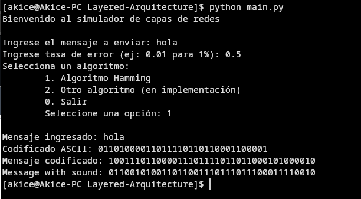

# Layered Arquitecture 🏗️

## 🌐 Entorno

- **Python:** 3.10.12  
- **Maven:** 3.6.3  
- **Java:** OpenJDK 21.0.8 (Ubuntu)  
- **SO:** Linux (WSL2), kernel 6.6.87.2-microsoft-standard-wsl2, amd64  

## 🚀 Ejecutar el programa

### Consola del **Emisor**

```bash
cd emisor
python3 -m venv venv
source venv/bin/activate
pip install -r requirements.txt
python main.py
```

### Consola del **Receptor**

```bash
cd receptor
mvn clean compile
mvn exec:java
```

## 🔧 Hamming Configuración

```bash
[1 bit algoritmo][N bits indicando m][bits codificados con Hamming][paridad global opcional]
```

- El bit del algoritmo depende del valor que se coloca en el archivo `protocol.yaml` actualmente se coloca 0 para Hamming.
- Los bits apartados para representar la cantidad de bits de data son 5 y estan definidos en `protocol.yaml`.
- Los bits codificados con Hamming es el proceso hecho por el algoritmo (este recibe una cadena de bits que se pasa a binario de 8 bits actualmente el cual se define en `protocol.yaml`).
- El bit de paridad global utilizado para detectar más de 1 error, este bits se coloca siempre y cuando la propiedadad `extended` esta como `true` en `protocol.yaml`.

## 🔄 Avances

Avances de la primera entrega creación de capa de aplicación, presentación, algoritmo y ruido.


